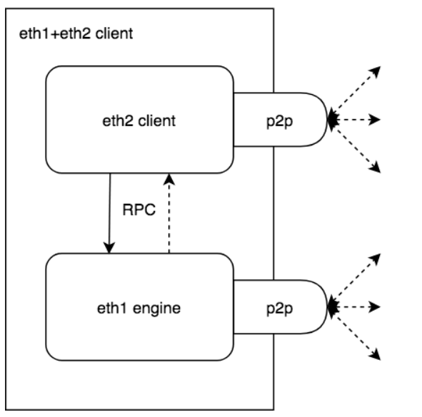
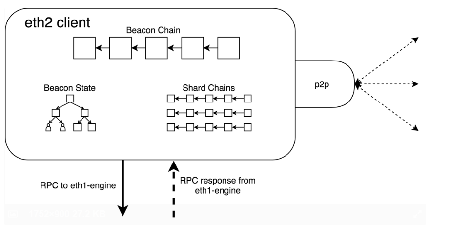
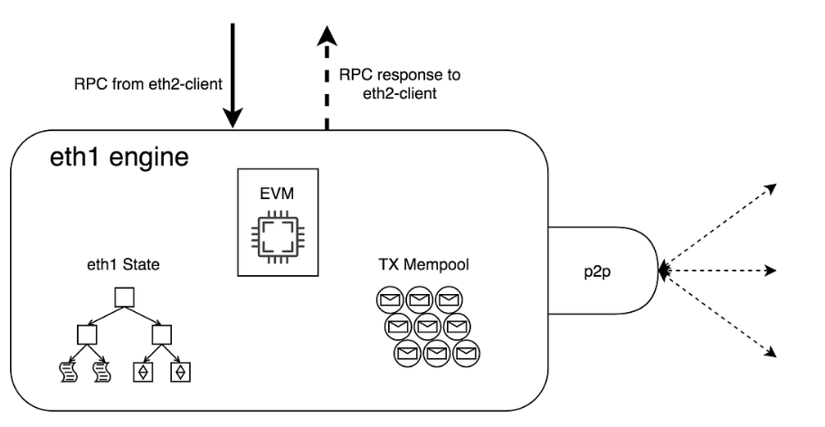

## 1. Uniswap
### 1.1 UniswapV2  
推荐好文：[当面试官问你Uniswap的时候，你应该想到什么？](https://learnblockchain.cn/article/2753)  
专有名词： 
- 自动做市商(Automated Market Makers)：采用恒定乘积公式(k = x * y)
- 数值精度：UniswapV2采用UQ112.112这种编码方式来存储价格信息。
- 闪电兑(FlashSwap)
- LP token
- EIP 712 no permission
- create2
- oracle:TWAP

## n. 对合并后ETH运行方式的思考
**What does it look like** 
Broadly, an eth1+eth2 client looks like the following:  
大致上来说，一个ETH1+ETH2的客户端看上去像这样：  
  
The eth2-client and eth1-engine are running together, locally communicating over RPC driven by the eth2-client.  
Each maintains it's own p2p interface, connecting to peers and handling a network protocol related to each particular domain.  
main questions
ETH2客户端和ETH1引擎一起运行，它们相互通过运行在ETH2客户端上的RPC进行交互。  
它们各自维护自己的p2p接口，和每个点连接并处各种领域的网络协议。

### ETH2-client
   
  
Why eth2-client handle eth1 block gossip?
eth2 is designed to generically handle the production, gossip, and validation of shard-blocks. We aim to make the eth1 shard as standard and comformant to the rest of the shards as possible. With respect to the core consensus, the main difference eth1 blocks have compared to the rest of the shards is the ability to execute/validate the contents of the block against the eth1 engine.

When a validator is working to crosslink an eth1 shard-block into the beacon-chain, the eth2-client would make an additional call the eth1-engine to execute and validate the block.

When a stateful eth1+eth2 node receives a new eth1 shard-block, the eth2-client would make an additional call to the eth1-engine to validate the block and update the local state storage.

Transaction gossip and mempool
The eth1-engine maintains user transaction gossip and the eth1 transaction mempool in almost the exact same way as in Ethereum today. The same network protocols and local mechanics can be used to gossip and maintain the pool, ready for block production.

The primary difference is how knowledge of spent transactions is ascertained and how the pool is utilized for block production, but these are arguably in a layer right outside of the pool.

eth1 shard-blocks are provided to the eth1-engine from the adjunct eth2-client. Transactions included in such blocks should be cleaned from the mempool in a similar way to Ethereum mainnet PoW blocks today.

eth1 shard-blocks are produced on demand from the adjunct eth2-client via the contents of the mempool. This RPC method and the underlying functionality is similar to getWork but would return the full block contents rather than just a hash.

Block production
Within the eth2 protocol, all blocks (beacon, shard, eth1-shard) must be produced and signed by a PoS validator from the core consensus. To this end, the eth2-client is ultimately responsible for all block production.

For beacon blocks and non-eth1 shard-blocks, the eth2-client has everything it needs to produce valid blocks.

For the eth1 shard-blocks, the eth2-client does not have immediate/ready access to eth1 state, transactions, and other underlying eth1 structures to produce a valid block. Instead, when a validator is assigned to produce an eth1 block, the eth2 client requests a viable eth1 block data (TXs, state root, etc) from the eth1-engine. The eth2-client then bundles this eth1 block data into a full shard-block (adds slot, proposer_index, proposer_signature, etc) and broadcasts the block to the network.

The eth1-engine is able to produce valid/viable eth1 block data because it manages the eth1 transaction mempool in the same way that it does on Ethereum mainnet today, and it maintains up-to-date info on the head eth1 state via updates from the eth2-client.

1. Who is capable to execute the transactions and pack the blocks?  
In Eth2, 
2. Who is entitle to publish one block?
References
1. [Eth1+eth2 client relationship](https://ethresear.ch/t/eth1-eth2-client-relationship/7248)
2. [成都链安：以太坊2.0技术浅析](https://learnblockchain.cn/article/1352)
3. [图解以太坊发展路线](https://learnblockchain.cn/article/2463)