# 搞定evm中的memory
在[第一部分](https://learnblockchain.cn/article/3647)，我们分析了remix的第一个合约示例1_Storage.sol。
```
// SPDX-License-Identifier: GPL-3.0

pragma solidity >=0.7.0 <0.9.0;

/**
 * @title Storage
 * @dev Store & retrieve value in a variable
 */
contract Storage {

    uint256 number;

    /**
     * @dev Store value in variable
     * @param num value to store
     */
    function store(uint256 num) public {
        number = num;
    }

    /**
     * @dev Return value 
     * @return value of 'number'
     */
    function retrieve() public view returns (uint256){
        return number;
    }
}
```
然后我们编译生成了字节码，并关注了与函数选择有关的部分。在这篇文章中，我们将重点讨论合约运行时字节码的前5个字节。
```
6080604052
```
```
60 80                       =   PUSH1 0x80
60 40                       =   PUSH1 0x40
52                          =   MSTORE 
```
这5个字节代表了 "自由内存指针(free memory pointer)"的初始化。为了充分了解这意味着什么，以及这些字节的作用，我们必须首先建立你对管理合约内存(memory)的数据结构的认知。
## 内存(memory)的数据结构
合约内存是一个简单的字节数组，数据可以以32字节（256位）或1字节（8位）为单位存储，以32字节（256位）为单位读取。下面的图片说明了这种结构以及合约内存的读/写功能。  
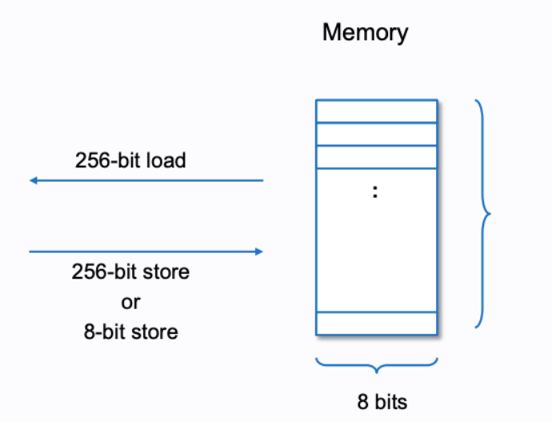
这种功能是由3个操作码决定的，这些操作码对内存进行操作。
- MSTORE(x, y) - 从内存位置 "x "开始存储一个32字节（256位）的值 "y"。
- MLOAD(x) - 从内存位置 "x "开始读取一个32字节（256位）的值并加载到调用栈(stack)上
- MSTORE8(x, y) - 在内存位置 "x"（32字节栈值的最小有效字节）存储一个1字节（8位）的值 "y"。
你可以把内存位置看成是开始写/读数据的数组索引。如果你想写/读超过一个字节的数据，你只需从下一个数组索引继续写或读。
## EVM Playground
这个EVM操练场([EVM Playground](https://www.evm.codes/playground?unit=Wei&codeType=Mnemonic&code=%27Vg*\(_I...1W0GJ_!!!!z00FK22WJQ0Y22z20F8K33W33Q1Y33z21F8d\(v0Z0-Jq00Xd\(vJZJ-64q20Xdv33Z33-65q21Xpp%27~N%20locatioCzG1_wppVv7o7hBcall%20stack%20from~uIIIIq\(%20ofNzp%5Cnj%20bytegSTOREdw\)*_%200xZ9BY9Chex%7DzXpM\)W%20at~V%2F%2F%20MQ%20%7B0x2N%20memoryKwg8%201j_J32I11GpPUSHFpMgCn%20Be%209%20i7%20t*%20J\)LOAD\(js!uu%01!\(\)*79BCFGIJKNQVWXYZ_dgjpquvwz~_))将有助于巩固你对这3个操作码的理解以及内存位置的工作原理。点击 "运行 "和右上方的卷曲箭头，步进操作码，看看堆栈和内存是如何被改变的。(在操作码的上方有注释，描述了每一部分的作用)  
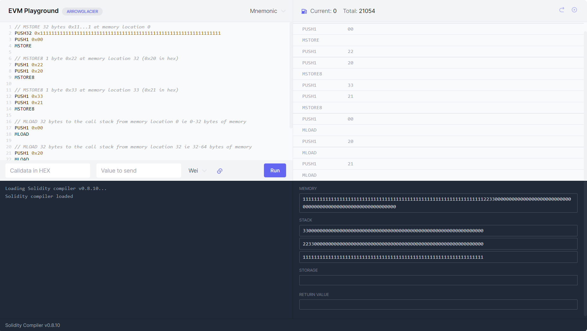
当执行完上面的操作码，你可能会注意到一些奇怪的现象。首先，当我们写入一个单字节数据0x22到内存中，然后用MLOAD8到内存位置0x20(十进制：32)取数据时，得到的不是    
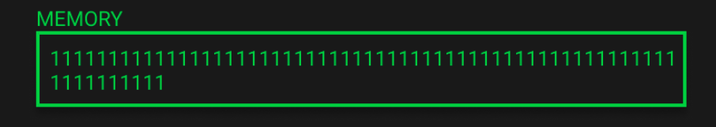
而是    
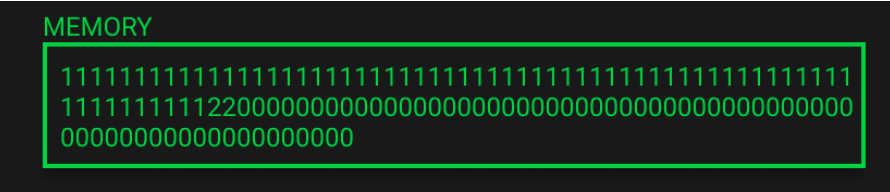
你也许会问了，我们只写入了一个字节，怎么会有这么多的零？
## Memory Expansion(内存拓展)
当你的合约写到内存时，你必须为所写的字节数付费。如果你写到一个以前没有被写过的内存区域，那么第一次使用该区域会有一个额外的内存扩展费用。
当写到以前未使用的内存空间时，内存以32字节（256位）的增量进行扩展。
> 内存拓展成本在最初的724字节成线性比例增加，之后会以二次方比例增加
上面例子中我们在写入1个字节前已经使用了32字节内存。再继续写入这一字节，我们开始向之前未使用的内存写入，结果，内存又被扩大了32字节的增量，达到64字节。
请注意，内存中的所有位置最初都被很好地定义为零，这就是为什么我们看到2200000000000000000000000000000000000000000000000000000000000000000000添加到我们的内存。
## 记住EVM中的内存存储器是个字节数组
第二个关键现象你可能已经注意到了，当我们运行MLOAD操作码从内存位置0x21(十进制：33)读取数据时。我们获得一个返回值，并被压入了栈区(stack)。  
这意味着我们可以从非32字节对齐的内存位置读取数据。  
记住内存是一个字节数组，这意味着我们可以从任何内存位置开始读（和写）。我们不受限制于32的倍数。内存是线性的，可以在字节级别上寻址。  
> 内存只能在一个函数中新创建。它可以是新实例化的复杂类型，如数组/结构（例如通过new int[...]）或从存储引用(storage)的变量中复制。  
现在我们对数据结构有了一丢丢的了解，让我们回到自由内存指针(free memory pointer)的问题上。  
## Free Memory Pointer(自由内存指针)
Free Memory Pointer只是一个指向自由内存开始位置的指针。它确保智能合约知道已写入和未写入的内存位置。  
这可以防止合约覆盖一些已经分配给另一个变量的内存。  
当一个变量被写入内存时，合约将首先参考Free Memory Pointer，以确定数据应该被存储在哪里。  
然后，它更新Free Memory Pointer，指出有多少数据将被写入新的位置。这两个值的简单相加将产生新的自由内存的起始位置。  
```
freeMemoryPointer + dataSizeBytes(数据大小) = newFreeMemoryPointer 
```
## 字节码
如前面所写，freeMemoryPointer是通过这5个字节码相对应的操作码定义的  
```
60 80                       =   PUSH1 0x80
60 40                       =   PUSH1 0x40
52                          =   MSTORE 
```
这些实际上说明了freeMemoryPointer在内存中位于memory中的0x40(十进制：64)位置，其值为0x80(十进制128).  
你可能立马想问咯，为啥会使用0x40和0x80呢？这个问题下面会解释。  
> Solidity的内存布局保留了4个32字节的插槽:
> - 0x00 - 0x3f (64 bytes): scratch space
> - 0x40 - 0x5f (32 bytes): free memory pointer
> - 0x60 - 0x7f (32 bytes): zero slot
我们可以看到，0x40是solidity为freeMemoryPointer预留的位置。值0x80只是在4个保留的32字节的插槽之后第一个可写的位置。  
我们快速浏览下每个保留部分的作用。  
- Scratch space: 可以在语句之间使用，例如在内联汇编语句和哈希方法中使用。（译者注：我也没看懂:(
- Free Memory Pointer: 当前分配的内存大小，自由内存的起始位置，最初为0x80
- Zero slot: 被用作动态内存数组的初始值，永远不能被写入。
## 实际合约中的内存
为了巩固我们到目前为止所学到的知识，我们要看一下内存和空闲内存指针是如何在真实的solidity代码中更新的。  
我创建了一个MemoryLane合约，并有意让它变得非常简单。它有一个函数，只是定义了两个长度为5和2的数组，然后给b[0]赋值为1。尽管很简单，但当这3行代码被执行时，会发生很多事情。  
```
// SPDX-License-Identifier: MIT
pragma solidity ^0.8.3

contract MemoryLane {
    
    function memoryLane() public pure {
        bytes32[5] memory a;
        bytes32[2] memory b;
        b[0] = bytes32(uint256(1));
    }
}
```

为了查看这个solidity代码在EVM中的执行细节，可以把它复制到一个remix IDE中。复制后，你可以编译代码，部署它，运行memoryLane()函数，然后进入调试模式，逐步浏览操作代码（关于如何做的说明，见[这里](https://remix-ide.readthedocs.io/en/latest/tutorial_debug.html)）。我已经将一个简化版本提取到[EVM Playground](https://www.evm.codes/playground?unit=Wei&callData=0xd275ca72&codeType=Mnemonic&code=%27BBQFreXM%3APointer%20%C2%8B~_BB_QvaluXto%20storXfor%20NG80\)128%3F%2480Qlocatio9for%20NG40\)64%3F%C2%8EQjump!9%7Brequired%20to%20prevent%20stack%20underflow%7D%20_PUSH2Gffff___BBB~~~%C2%83a%7F%2F_BBB~~~_Qload%20N%2440_MLOAD_%23N_DUP1Q0xa0\)160%3F%2C%2032%20*%205\)160%20first%C2%8C5%24a0QN\(0x8%C2%82a0%7D\)new%20N_ADDQSavXthis%20new%20valuX0x120%20to%20thXfreXmemory!n%C2%8E_BB%2FQM%3A%C2%8BVaraiblX%E2%80%9Ca%E2%80%9D%20~%2F_BB%2F_%230x80_DUP1QpushG05\)5%3F\(array%20length%7D%2405QSwap%20thXtop%202-tems%20%C2%86andG80_SWAP1QpushG20\)32%C2%88e%7D%2420QDuplicatXthX3rd%3B%C2%86to%20thX%C2%84_DUP3Q0x05%20*G20\)5%20*%2032-9decmial\)160%20o9%C2%84\(sizXof%20array-9bytes%7D_MULQDuplicatX0xa0\)160%3F_DUP1QReturns%20sizXof%20calldata-9bytes%20currently%20just%C2%90%3DG04%20or%204-9decmial%C2%89stack\(0x80%7D_DUP4Q0x80\(%7CXcopie%40Ga%C2%8A_Qthis%20offsets%20thX4%20bytes-9our%20call%20data%20with%20a%20sizXofGa0%20which%20yeild%20a%20160%20bit%20set%20of%200%22s%20to%20bXstored%20at%20thXN!n_Qthis%20effectively-nitialises%20our%20array-9m%3A%C2%87%60%C2%80%25eded_%230xa0_DUP1%230x80_DUP3Qnew%20N%20as%20before_ADDQswap%201st\(0x120%7D%3Bo9%3E%20and%203rd\(0x80%7D_SWAP2K80%7D_POPKa0%7D_POPQS%C2%81120%20%26G05_SWAP1K05%7D_POPK120%7D_POPQs%C2%8180%20%26Gb6\(jump!n%7D_SWAP1%C2%8D%5E%C2%85%C2%85%C2%8D%2C%5E_BBB~~%2F%C2%83b%7F_BBB~~%2F_QN%20load-9%2440_MLOAD%23N\(0x120%7D_DUP1Q0x40\)64%3F%2C%2032%20*%202\)64%20second%C2%8C2%2440QN\(0x12%C2%8240%7D\)new%20N_ADDQsavXnew%20N%20valuXat%20freXmemory!nG40%C2%8EBBQM%3A%C2%8BVariablX%E2%80%9Cb%E2%80%9D%20~_BB_%230x120\(m%3Astart!9for%20variablX%5C%27b%5C%27%7D_DUP1Q0x02\)2%3F\)array%20length%2402Qs%C2%8102%20%26G120_SWAP1Q0x20\)32%C2%88Xi9bytes%7D%2420%233rd%3Bo9%3EG02_DUP3Q0x02%20*G20%20%3DG40\)64\(amount%20of%20bytes-9m%3Ato-nitialise%7D_MUL%230x40\(N!n%7D_DUP1QsamXas%20beforX4%20bytes%20for%C2%900x04%C2%89%3E%20%3DG120_DUP4Q0x120\(%7CXcopie%40G4%C2%8A%C2%87%60%C2%80%25eded__~duplicatXthX%C2%84G40_DUP1%233rd%3Bo9%3EG120_DUP3Qadd%20together%20yields%20N%20value_ADDQswapG160%20%26G120_SWAP2K120%7D_POPK40%7D_POPQswapG160%20%26G02_SWAP1K02%7D_POPK160%7D_POPQjump!9to%20%C2%84Gbe_SWAP1QsimulatXjump%20pop%20jump!9off%20stack_POP__B~~~QAssig9ValuXto%20b%5B0%5D%20~_B~~~_QpushG01%2C%20valuXto%20add%20b%5B0%5D%2401QpushG00%2400Qleft%20shift%20operatio9no%20shift%2C%20first-nput-s%200%20_SHL%C2%91120%7D_DUP2QpushG00\)%5B0%5D%20wherXi9thXarray%20should%20this%3Bgo%2400QpushG20\)64%20bytes%20thXlength%20of%20thXarray%20%2402%C2%9100%7D_DUP2Q0x00%20%3CG20\)%20truX%3DG01\(check%20thXuser-s%20not%20trying%20to%20storXa%20valuXat%20a!9that%20doesn%22t%20exist-9thXarray%7D_LTQjump!n_PUSH2G00d7Q2%20POPs%20sincXthis-s%20a%20JUMPI\(checking-f%20LT%20returned%20truXor%20false%7D%C2%8F%C2%8F_QpushG20\(32%20bytes%20aray%3Bsize%7D%2420Q0x20%20*G00%20%3DG00\)0%C2%88X*-ndex%20to%20determinXbytXoffset%7D_MULQ0x00%20%2BG120_ADD%232nd%20o9stackG01\(valuXfor%20b%5B0%5D%7D_DUP2%232nd%20o9stackG120\(memory!9for%20b%5B%5D%7D_DUP2QstorX0x01%20at%20memory!nG120_MSTOREQclea9up%20stack_POP_POP_POP_POP_%27~%2F%2F_%5CnXe%20Q_~%20NfreXm%3ApointerKQpop%20top%3Boff%20stack\(0xG%200xB~~~~~~~~~~9n%20-%20i\)%20%3D%20\(%20%7B!%20locatio%23QduplicatX%24_PUSH1G%25%5C%27a%5C%27%20and%20removes%20any-tems%20that%20arXno%20longer%20ne%3Aemory%20%3B-tem%20%3EthXstack%3F-9decimal%40d.%7D%2CG04\(bytXoffset-9thXcalldata%20to%20copy.%7D%2C%5E%20removXthXtop%3Boff%20stack%20with%20POP_POP_%60ng%20lines-9this%20sectio9manipulatX%3E%20to%20%7CbytXoffset-9thXm%3AwherXthXresult%20will%20b%7F%E2%80%9D%20%26%20FreXM%3APointer%20UpdatX~%C2%80ensurXwXhavXthXmemory!9of%20variablX%C2%81wap%20top%202-temsG%C2%820%7D%20%2B%20spacXfor%20array\(0x%C2%83QM%3AAllocatio9VaribalX%E2%80%9C%C2%84top%20of%20%3E%C2%85QSimulated%20jump!n_PUSH2Gffff%C2%86o9%3E-9this%20casX0x05%20%C2%87_CALLDATACOPY_QThXremaini%C2%88%3F\(array%3Bsiz%C2%89_CALLDATASIZE%234th%3Bo9%C2%8A0\(bytXsizXto%20copy.%7D%C2%8BInitialisatio9%C2%8C%20array-s%20length%20%C2%8DQsimulating%20a%20JUMP%C2%8E%2440_MSTORE__%C2%8FQsimulatXJUMPI%20_POP%C2%90%20functio9signaturX%C2%91%232nd%3Bo9stack\(0x%01%C2%91%C2%90%C2%8F%C2%8E%C2%8D%C2%8C%C2%8B%C2%8A%C2%89%C2%88%C2%87%C2%86%C2%85%C2%84%C2%83%C2%82%C2%81%C2%80%7F%7C%60%5E%40%3F%3E%3B%3A%25%24%23!\(\)-9BGKNQX_~_)中，并将在下面运行它。
简化版按顺序组织操作码，去掉了JUMP和任何与内存操作无关的操作码。代码中加入了注释，以解释现在在做啥。这段代码被分成6个不同的部分，我们将深入研究。
我不能不强调，使用EVM Playground和自己按步执行操作码是多么重要。这将大大促进你的学习。现在让我们来看看这6个部分。  
## Free Memory Pointer初始化（EVM Playground Lines 1-15）
首先，咱已经在上面初步讨论过FreeMemoryPointer的初始化，一个0x80的值被放入stack中。这是FreeMemoryPointer的值，由solidity的内存布局决定。在这个阶段，我们的内存没有任何东西.  
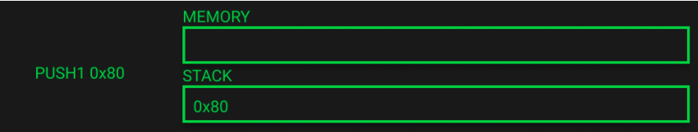
接下来，把FreeMemoryPointer的内存位置0x40放到stack中。  
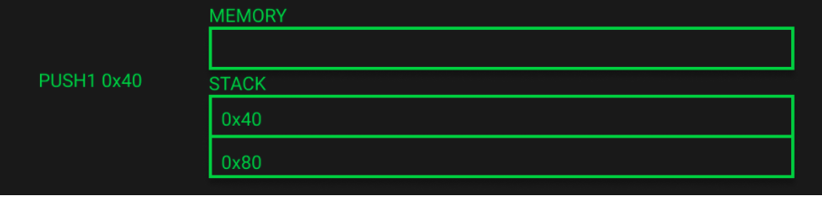
最后，我们调用MSTORE，从stack中弹出0x40，以确定写入内存的位置，第二个值0x80作为写入内容。  
这样stack就空了，但现在内存中存在一些值了。这个内存表示是十六进制的，每个字符代表4位。  
我们在内存中有192个十六进制字符，这意味着我们有96个字节（1字节=8比特=2个十六进制字符）。  
如果我们参考Solidity的内存布局，我们知道前64个字节将被分配为scratch空间，接下来的32个字节将是Free Memory Pointer。  
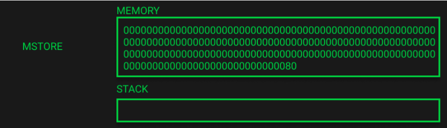
## 内存分配变量 "a "和更新Free Memory Pointer（EVM Playground第16-34行）
对于剩下的部分，为了简洁起见，我们将跳到每一部分的结束状态，并对所发生的事情做一个高层次的概述。各个操作码的步骤可以通过EVM操场看到。  
接下来为变量 "a"（bytes32[5]）分配内存，并更新Free Memory Pointer。  
编译器将通过数组大小和默认的数组元素大小确定需要多少空间。  
> 请记住Solidity中内存数组中的元素总是占据32字节的倍数（这甚至对bytes1[]来说也是如此，但对bytes和字符串来说不是如此）
数组的大小乘以32个字节，告诉我们需要分配多少内存。  
在这种情况下，5*32的计算结果是160，即十六进制的0xa0。我们可以看到这个值被推入stack，并与当前的Free Memory Pointer位置0x80（十进制为128）相加，得到新的Free Memory Pointer。  
这将返回0x120（十进制288），我们可以看到它已被写入Free Memory Pointer位置。  
调用堆栈将变量 "a "的内存位置0x80保留在stack中，这样它就可以在以后需要时引用它。0xffff代表一个JUMP位置，可以被忽略，因为它与内存操作无关。  
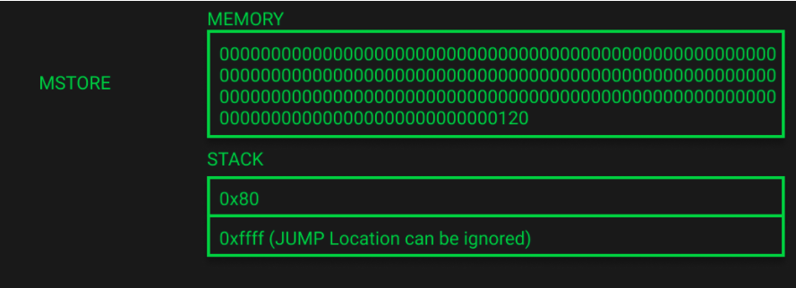
## 内存初始化变量"a"（EVM Playground第35-95行）
现在，内存已经分配完毕，Free Memory Pointer也已更新，我们需要为变量 "a "初始化内存空间。由于该变量只是被声明而没有被分配，它将被初始化为零值。  
为了做到这一点，EVM使用CALLDATACOPY，它接收了3个变量。  
- memoryOffset (要复制数据到哪个内存位置)
- calldataOffset (要复制的calldata中的字节偏移)
- size (要复制的字节大小)
在我们的例子中，memoryOffset是变量 "a "的内存位置（0x80）。calldataOffset是我们calldata的实际大小，因为我们不想复制任何calldata，我们想用零值初始化内存。最后，大小是0xa0或160字节，因为这是该变量的大小。  
我们可以看到我们的内存已经扩展到288字节（这包括zero slot），stack再次持有变量的内存位置和调用堆栈上的一个JUMP位置。  
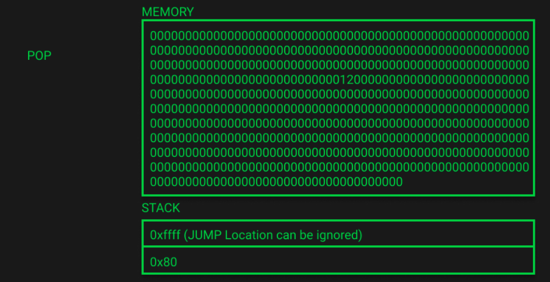
## 内存分配变量 "B"和更新Free Memory Pointer（EVM Playground第96-112行）
这与变量 "a "的内存分配和Free Memory Pointer更新相同，只是这次是针对 "byte32[2]内存b"。  
Free Memory Pointer被更新为0x160（十进制352），这等于之前的Free Memory Pointer位置288加上新变量的大小（字节64）。  

请注意，Free Memory Pointer在内存中已经更新到了0x160，我们现在在stack上有变量 "b "的内存位置（0x120）。  
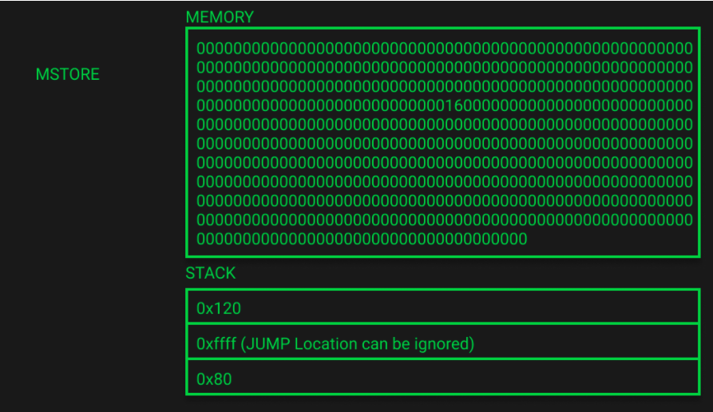
## 内存初始化变量"b"（EVM Playground第113-162行）
与变量 "a "的内存初始化相同。  
请注意，内存已经增加到352字节。stack仍然保存着2个变量的内存位置。  
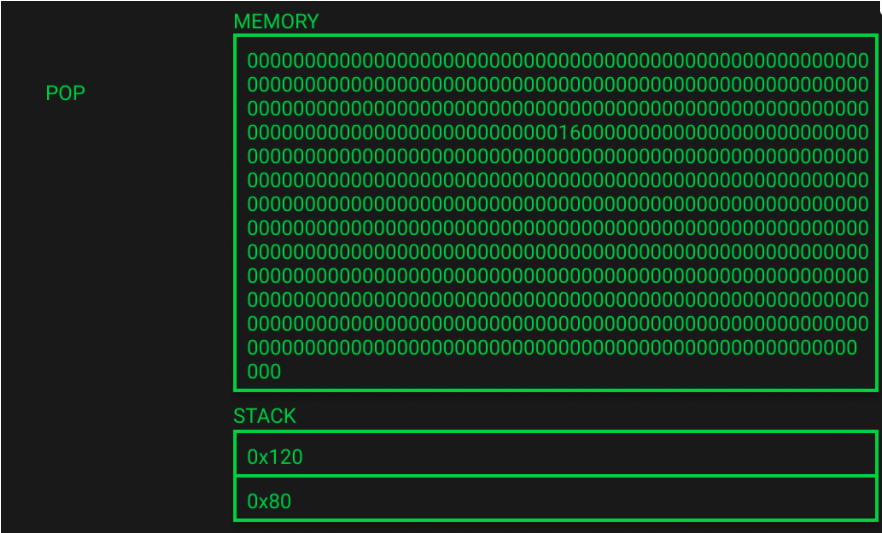
## 为b[0]赋值（EVM Playground第163-207行）
最后，我们要给数组 "b "的索引0赋值。代码指出b[0]应该有一个1的值。  
这个值0x01被push到stack的。接下来会发生一个位的左移，但是位移的输入是0，意味着我们的值不会改变。  
接下来，要写到0x00的数组索引位置被推到stack中，并进行检查以确认这个值小于数组的长度0x02。如果不是，执行就会跳到其他字节码，以处理这个错误状态。  
MUL(乘法)和ADD操作码用于确定在内存中需要写入的数值，以使其对应于正确的数组索引。  
```
0x20 (32 in decimal) * 0x00 (0 in decimal) = 0x00
```
记住内存数组是32字节的元素，所以这个值代表数组索引的起始位置。鉴于我们正在向索引0写入，所以偏移值为0。  
```
0x00 + 0x120 = 0x120 (288 in decimal)
```
ADD是用来将这个偏移值添加到变量 "b "的内存位置。鉴于我们的偏移量是0，我们将直接把数据写到指定的内存位置。  
最后，一个MLAD将数值0x01加载到这个内存位置0x120。  
下面的图片显示了函数执行结束时的系统状态。stack里所有的变量都已经被弹出了。  
注意在实际的remix中，有几个变量留在stack上了，一个JUMP位置和函数签名，但是它们与内存操作无关，因此在EVM playground中被省略了。  
我们的内存已经被更新，包括b[0]=1的赋值，在我们内存的倒数第三行，一个0值已经变成了1。  
你可以验证该值是否在正确的内存位置，b[0]应该占据位置0x120 - 0x13f（字节289 - 320）。  
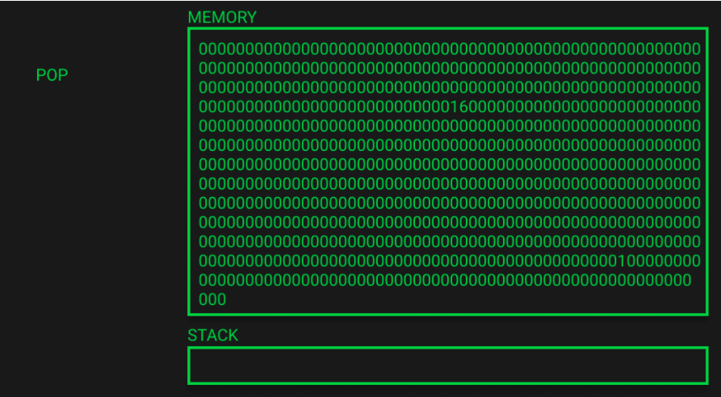
我们终于搞定啦，吸收这么多知识，帮助我们对合约内存的工作有了坚实的理解。下次我们需要写一些solidity代码时，这将对我们有好处。  
当你执行一些合约操作码，看到某些内存位置不断pop出（0x40）时，你现在就会知道它们的确切含义。  