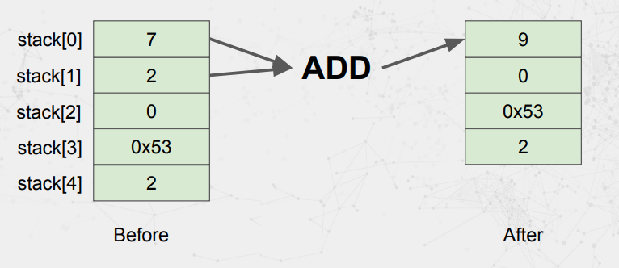
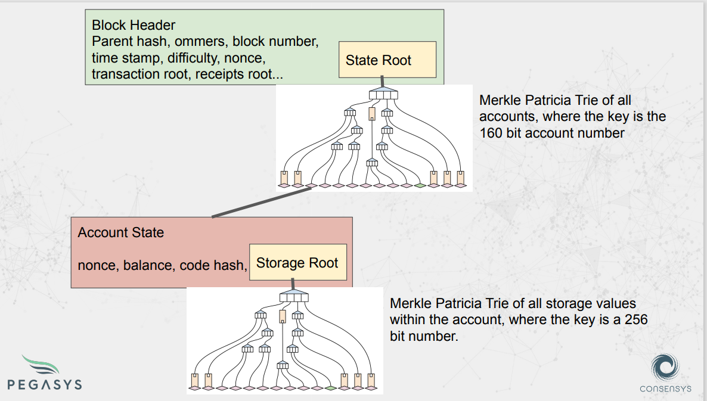

# Transctions
## Transction Fields: Value transfer
- Nonce: the transaction number for this account, start with 0.
- Gas Price: the price in Wei that this transaction will pay for gas.
- Gas Limit: 21000
- To: the address to send the Ether to.
- Value: the amount of Wei to send.
- Data: Empty(it's not mandatory to be empty, but, Transactions aren't part of world state)
- v,r,s: Components of the transaction signature.

## Transction Fields: Contract Deployment
- Nonce: the transaction number for this account, start with 0.
- Gas Price: the price in Wei that this transaction will pay for gas.
- Gas Limit: the maximum amount of gas that this transaction can use.
- To: Empty.
- Value: the amount of Wei to send.
- Data: The init code to set-up the contract state and deploy the contract.
- v,r,s: Components of the transaction signature.

## Transction Fields: Function Call
- Nonce: the transaction number for this account, start with 0.
- Gas Price: the price in Wei that this transaction will pay for gas.
- Gas Limit: the maximum amount of gas that this transaction can use.
- To: the address the transaction is sent to.
- Value: the amount of Wei to send.
- Data: Data that the code in the EVM processes and does stuff with.(a blob of data that the EVM code can do stuff with)
- v,r,s: Components of the transaction signature.

# Stack, Memory, Storage, Code, CallData, Logs
- The EVM is a stack based processor
- EVM Opcodes pop information from and push information onto the stack.  
  

The EVM can access and store information in six places:
- Stack: EVM Opcodes pop information from and push data onto the stack.
- CallData: The data field of a transaction. These are parameters to the call.
- Memory: Information store accessible for the duration of a transaction.
- Storage: Persistent data store.
- Code: Excuting code and static data storage.
- Logs: Write-only logger / event output.
  

