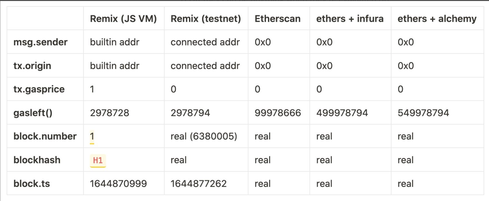
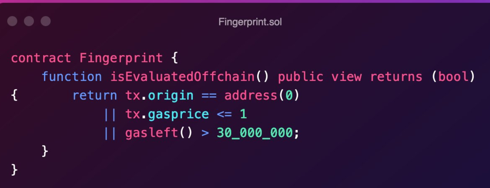

> 1. How would you call a function on a third party contract B, on behalf of the sender, through your contract A, guaranteeing no reverts?

**解析：**
题目意思就是如何通过合约A代表发送者调用合约B的函数，答案很简单咯，就是[delegatecall](https://solidity-by-example.org/delegatecall/)。

```javascript
contract B{
    uint value;
    function test(){
        value = 10;
    }
}

contract A{
    function _delegate(address _B){
        (bool suc,) = _B.delegatecall(abi.encodeWithSignature("test"));
        require(suc, "delegate call failed");
    }
}
```

---

> 2. What’s the main difference between a transparent proxy and a universal proxy?

**解析：**
题目意思是透明合约和代理合约的主要区别是啥？社区里这篇[文章](https://learnblockchain.cn/article/1933#%E4%BB%A3%E7%90%86%E5%AD%98%E5%82%A8%E5%86%B2%E7%AA%81%E5%92%8C%E9%9D%9E%E7%BB%93%E6%9E%84%E5%8C%96%E5%AD%98%E5%82%A8)很详细的介绍了这俩代理模式的。可以瞅一瞅。

```js
contract TransparentProxy{
    uint public value;
    address public implementation;
    address public owner;
    constructor(address _v1){
        implementation = _v1;
        owner = msg.sender;
    }
    modifier onlyOwner(){
        require(msg.sender == owner, "only owner");
        _;
    }
    function _upgrade(address _newImplementation) public onlyOwner{
        implementation = _newImplementation;
    }

    function _delegatecall() public {
        (bool suc,) = implementation.delegatecall(msg.data);
        require(suc, "delegatecall failed");
    }
}


contract BoxV1{
    uint public value;
    function set(uint _value) public{
        value = _value;
    }
}
```

```js
contract UniversalProxy{
    uint public value;
    address public implementation;
    constructor(address _v1){
        implementation = _v1;
        
    }   
    function _delegatecall() public {
        (bool suc,) = implementation.delegatecall(msg.data);
        require(suc, "delegatecall failed");
    }
}

abstract contract Box{
    uint public value;
    address public implementation;
    address public owner ;
    modifier onlyOwner(){
        require(msg.sender == owner, "only owner");
        _;
    }
    function _upgrade(address _newimplementation) public onlyOwner {
        implementation = _newimplementation;
    }
}
contract BoxV1 is Box{
    function set(uint _value) public {
        value = _value;
    }
}
```

通用代理优势：通过在实现合约上定义所有函数，它可以依靠Solidity编译器检查任何函数选择器冲突。此外，通用代理的大小要小得多，从而使部署更便宜。在每次调用中，从存储中需要读取的内容更少，降低了开销。
通用代理劣势：如果一次合约忘记写upgrade函数，将会永远无法升级了。

---

---

> 3. How could you destroy the implementation of, and effectively brick, a universal proxy?
>    Assumptions:
> 
> * You re not the owner of the proxy
> * No one owns the implementation
> * The implementation uses delegatecall to guarantee that the next implementation is not sterile

**解析：**
题目大概意思是，如何毁掉一个通用代理下的实现合约？条件如下：

- 你不是代理合约的owner
- 没人是implementation合约的owner
- implementation合约使用了delegatecall去保证每个implementation合约总是可升级的（可以看上面的通用代理劣势）

因为implementation合约里有调用delegatecall，去调用别的合约，那只要在该合约中加一个selfdestruct函数，即可完成对通用代理的毁灭。所以在implementation合约里最好不要使用selfdestruct和delegatecall函数。详细可以查看这篇[文档](https://docs.openzeppelin.com/upgrades-plugins/1.x/writing-upgradeable#potentially-unsafe-operations)

---

> 4. What’s the danger of using tx.origin for user authentication in a smart contract?

**解析：**
tx.origin是最开始调用合约的EOA账户（外部账户），如果你的合约A用了tx.origin来判断身份的话，最好就别执行了陌生的合约了，因为可能该合约会调用合约A，来转走你的钱。 如果你没看懂我在说啥的话，这里提供个[案例](https://solidity-by-example.org/hacks/phishing-with-tx-origin/)去参考下。

---

> 5. What kind of proxy would you use to update an indefinite amount of instances with a single implementation upgrade? And how would it work?

**解析：**
题目大概意思是：什么样的代理可以让你只要升级一次实现，完成多个实例代理呢？
使用信标代理，信标代理特征，再加一层合约，其保存着implementation，代理合约存着信标合约地址。示例如下：

```js
contract Proxy {
    address immutable beacon = 0xaaaaaaaaaaaaaaaaaaaaa;
    fallback() external payable{
        address implementation = beacon.implementation();
        return implementation.delegatecall(msg.data);
    }
}

contract Beacon{
    address public implementation;
    function upgrade(address _newImplementation) public onlyOwner{
        implementation = _newImplementation;
    }
}
```

---

> 6. Whats the deal with external vs public? When should you use external? When not? Why is it cheaper than public?

**解析：**
External函数一般是外部合约或者EOA账户调用，如果是合约内部其他函数调用，需要使用方法*this.xxx()*，Public函数外部内部都可以调用。
External函数更便宜是因为它的参数可以直接从calldata里取出，而Public函数则需要先把他们加载到Memory里，这会消耗更多的gas。
另外注意使用*this.xxx()*时，会改变msg.sender，具体如下：
You can only call external functions with this using *this.xxx()*. External uses params directly from calldata, without uploading them to memory.

```js
//EOA address: 0x5B38Da6a701c568545dCfcB03FcB875f56beddC4  call A.callFunc()
contract A{
    address immutable caller = 0x5B38Da6a701c568545dCfcB03FcB875f56beddC4;
    function callFunc() public{
        testPublic();
        this.testExternal();
    }

    function testPublic() public{
        require(caller == msg.sender, "when u use Public, the msg.sender is still the caller before");
    }

    function testExternal() external{
        require(address(this) == msg.sender, "when u use Exteranl, the msg.sender is the contract self");
    }
}
```

---

> 7. 3rd party contract B with function b() writes to state in ways outside of your control. How would you simulate a call to b() from your contract A, observe the side effects, and then undo them entirely without reverting the main execution thread?

**解析：**
题目大概意思是：如何调用第三方合约的函数b()，并保证不会干扰你的主要执行线程。
使用try...catch...，下面举个例子，安全转账ERC20。

```js
contract B is ERC20{
    function transferFrom(address _sender, address _to, uint _amount) public returns (bool){
        //...
    }
}


contract A{
    function interactWithToken(uint _amount){
        IERC20 token = IERC20(tokenAddress);
        bool success;

        try token.transferFrom(msg.sender, address(this), sendAmount)returns(bool _success){
            success = _success;
        } catch Error(string memory) {
            success = false;
        } catch (bytes memory) {
            sucess = false;
        }

        if(success) {
            // handle success case
        } else {
            // handle failutre case without reverting
        }
    }
}
```

---

> 8. Dynamically sized types in function signatures may be preceded by the keywords “memory”, “storage”, or “calldata”. When is it optimal to use each of them?

**解析：**
题目大概意思是函数参数中的动态类型对象可以注明关键词"memory","storage","calldata"，分别什么情况下使用。
calldata基本是为external函数服务的。它跟memory很像，只是是不可更改的，memory是可更改的。storage类型只能在internal函数中传递，并作为引用传送，这样才能写入。
ans: calldata is purely for external functions. It's similar to memory in most aspects but is immutable memory data is mutable. Storage types can only be passed within internal functions and are sent as reference to enable writing into them.

---

> 9. Is there a way to revert with dynamic error messages?  I.e. “Error: Price must be > 1 ETH”, where 1 is a value held in a state variable in your contract.

**解析：**
如下所示：

```js
contract example{
    function test() public{
        uint8  value = 1;
        string memory tmp = string(abi.encodePacked("Error:Price must be", value, " ETH"));
        require(false, tmp);

    }
}
```

---

> 10. Bob calls contract A, which delegate calls contract B, which delegate calls contract C, which calls contract D, which delegate calls contract E, which delegate calls contract A.Who is msg.sender when the execution reaches back contract A?

**解析：**

```
when Bob call A, sender is EOA
when A dcall B,  sender is EOA
when B dcall C,  sender is EOA
when C call D,   sender is C now 
when D dcall E,  sender is C 
when E dcall A,  sender is C
The ans is C.
```

---

> 11. When you compile a Solidity contract, you get "bytecode" and "deployedBytecode". They are almost identical. What's the difference? Where is the difference? And why is there a difference?

**解析：**
题目大概意思是，当你编译一个solidity合约时，你会得到"bytecode"和"deployedBytecode"，它们俩基本一致，区别在哪，为啥会有这个区别？

bytecode是发送给地址0的msg.data，里面包含部署合约的字节码，它们将执行合约的构造函数，以及把合约代码（也就是deployedBytecode)写入state里。

---

> 12. Smart contract A’s view function a() needs to call a third party contract B’s b() function, which is also supposed to be view. Can it guarantee that it will really be read only too by just calling it, or does it need to take any additional precautions?

**解析：**
题目大概意思是，合约A的view函数a()调用合约B的函数b()，为了调用成功b()也得是view。如何保证调用的函数是只读的呢？还是需要额外的防护措施。这里可以采用staticcall，以及对执行结果进行判断。

```JS
contract A {
    B public b;
    
    constructor() {
        b = new B();
    }
    
    function callB() public view returns(string memory) {
        (bool success, bytes memory data) = address(b).staticcall(
            msg.data
        );
        
        if(!success) revert();
        
        return string(data);
    }
}
```

---

> 13. Does adding or changing comments on a contract affect its resulting runtime bytecode?

**解析：**
会有影响，会改变metadata值。

---

> 14. To index or not to index, that is the question. Does using indexed in events increase runtime gas costs? How about bytecode size?

**解析：**
事件的gas费公式如下:

```
375 + 375 * numberOfIndexedParameters + numberOfUnindexedBytes * 8.
```

比较下列gas费：

```
- event NewEvent(address addr)
- event NewEvent(address indexed addr)
- 375 + 375 * 0 + 20*8 = 535
- 375 + 375 * 1 + 0*8 = 750
```

可以看出，indexed事件消耗更多gas。

the indexed logs contract is just 370 bytes, while the unindexed log contract is 516 bytes. This is because the log opcodes in the evm load the values from memory, which require first loading the local variable from the stack into memory. Meanwhile indexed logs are loaded directly from the stack, which does not have the overhead of moving the variable into memory.

---

> 15. A contract contains an array of one million addresses, and a view function that simply returns this array. Will this function run out of gas when:
> 
> * Called by a contract?
> * Called externally by an EOA?

**解析：**
不论是谁调用view函数，都会计算gas。只是如果只是查询状态，不会真的扣钱。

```JS
contract A{
  uint public value;
  constructor()payable{
      value = 1;
  }
  function test() external view returns(uint){
      return value;   //不消耗gas
  }
  function test2() public{
      address _to = 0x4B20993Bc481177ec7E8f571ceCaE8A9e22C02db;
      uint _tmp = this.test(); //消耗 gas，因为该函数有修改状态
      (bool success,) = _to.call{value: _tmp}("");
      require(success,"failed");
  }
  
  function test3() external view returns(uint){
      return this.test();   //不消耗gas
  }
}
```

---
> 16. You have a public view function in a contract. Can it know whether it's been called as part of a transaction that mutates the root hash of the chain, as opposed to just a simple read call?

**解析：**
这题大概意思是如何防止你的用户调用你的view函数付出了gas费。
看老外做了个分析。 不同的平台EOA调用view函数时，tx.gasprice和tx.origin分别是多少

并且提供了个方法避免合约调用view函数。


---

> 17. You have a contract with 4 public functions. You add a 5th, and all of sudden calling function 4 costs less gas.

**解析：**

```
Because with four functions the contract is:

is this A? 
is this B? 
is this C?
is this D? 

You check four conditions.

However, with five functions the contract is:

is this  >= D? If so, jump to LBL
LBL:
is this D?
is this E?
```