# Ethereum Architecture(以太坊架构)
我们将从下面的图片开始。不要被吓倒，在本文结束时，你会明白这一切到底是如何结合在一起的。这代表了以太坊的架构和以太坊链中包含的数据。 
  
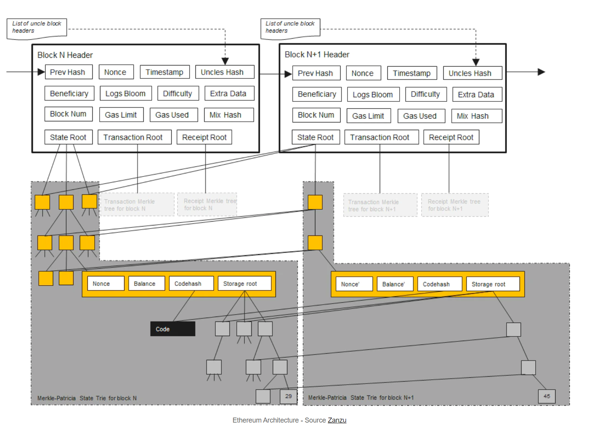  
与其将图表作为一个整体来看，我们不如逐块分析。现在，让我们把重点放在 "区块头N"和它包含的字段上。 

---

# Block Header(区块头)
区块头包含了一个以太坊区块的关键信息。下面是 "区块头N "片段，以及它的数据字段。看一下etherscan上的这个区块[14698834](https://etherscan.io/block/14698834)，看看你是否能找到图中的这些成员。  
  
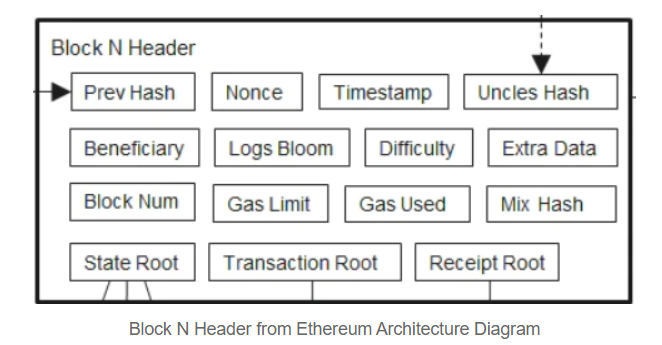  

该区块头包含以下成员。
- Prev Hash - 父区块的Keccak哈希值
- Nonce - 用于工作证明的计算
- Timestamp - 时间戳
- Uncles Hash - 叔块的Keccak哈希值
- Benficiary - 受益人地址，矿工地址
- Logs Bloom - 事件地址和事件topic的布隆滤波器
- Difficult - 前一个区块的难度
- Extra Data - 与该区块相关的32字节数据
- Block Num - 祖先块数
- Gas Limit -当前每个区块的gas使用限制值
- Gas Used - 该区块中用于交易的gas消耗值
- Mix Hash - 与nonce一起用来证明工作证明计算的256位值
- State Root - 状态树的根哈希值
- Transaction Root - 交易树的根哈希值
- Receipt Root - 收据树的根哈希值

让我们看看这些成员如何与 Geth 客户端代码库中的内容相对应。我们先看[block.go](https://github.com/ethereum/go-ethereum/blob/d4d288e3f1cebb183fce9137829a76ddf7c6d12a/core/types/block.go#L70)中定义的 "Header "结构，它表示一个块的头。  
  
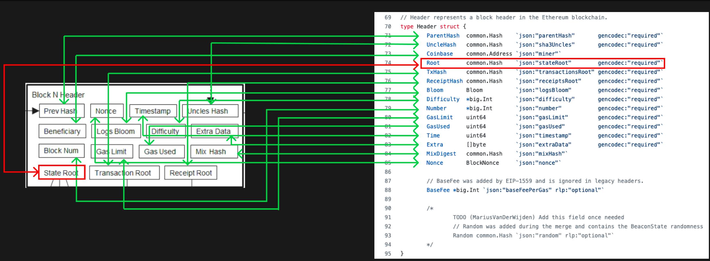  
我们可以看到，代码库中所述的值与我们的概念图相匹配。我们的目标是要如何从区块头找到我们合约的storage存储的位置。 

要做到这一点，我们需要关注块头的 "State Root"字段，该字段以红色标示。 

# State Root
"State Root"的作用类似于merkle root，因为它是一个依赖于它中间所有数据的哈希值。如果任何数据发生变化，根哈希值也会发生变化。  

在 "State Root"下面的数据结构是一个Merkle Patric Trie(MPT)，它为网络上的每个以太坊账户存储一个键值对，其中key是一个以太坊地址，value是以太坊账户对象。  

实际上，key是以太坊地址的哈希值，value是RLP编码的以太坊账户，但是我们现在可以忽略这一点。  

下面是 "以太坊架构 "图的一部分，表示State Root下的MPT。         
  
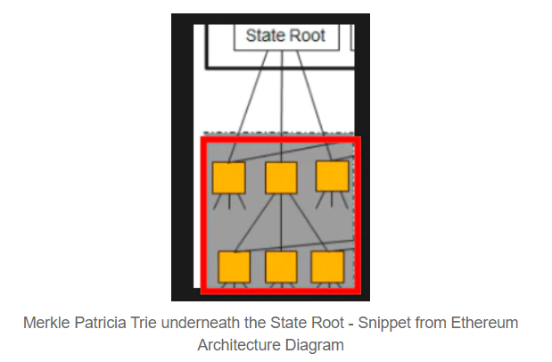  

Merkle Patricia Trie是一个非三态的数据结构，所以我们不会在这篇文章中深入研究它。我们可以继续抽象化地址到以太坊账户的键值映射模型。

如果你对Merkle Patricia Trie感兴趣，我建议你看看这篇优秀的介绍性[文章](https://medium.com/shyft-network-media/understanding-trie-databases-in-ethereum-9f03d2c3325d)。

接下来让我们细究一下以太坊地址所映射到的以太坊账户值。 
# Ethereum Account
以太坊账户是以太坊地址的共识代表，它由4部分构成   

- Nonce - 该账号的交易数量
- Banlance - 账户余额（以wei为单位）
- Code Hash - 合约字节码的hash值
- Storage Root - storage trie的根节点的hash值   

从以太坊架构图的部分片段里可以看到这些内容  
  
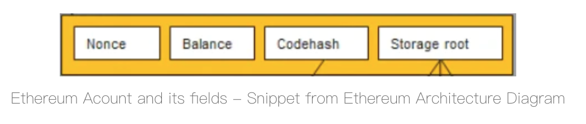  

我们再看Geth的代码，找到相关的代码'[state_account.go](https://github.com/ethereum/go-ethereum/blob/b1e72f7ea998ad662166bcf23705ca59cf81e925/core/types/state_account.go#L27)'，之前提及的以太坊账户结构被定义为‘StateAccount’。  
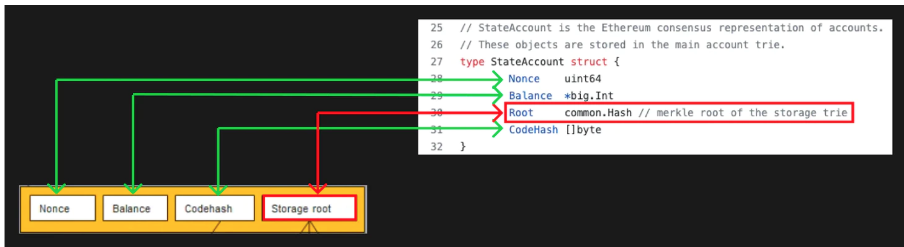  
我们可以看到代码里的结构成员一一对应我们的概念图。  
  
接下来，我们需要深入学习以太坊账户里的"Storage Root"字段。  

# Storage Root
storage root跟state root一样，在它下面也是一棵Merkle Patricia trie。  
  
区别在于这次key值是存储插槽(storage slots)，而value值是插槽里的数据。  
  
*再次注意这里实际上会对value进行RLP编码，以及对key取hash*  
  
下图是以太坊架构图里代表'Storage Root’的MPT的部分。 
   
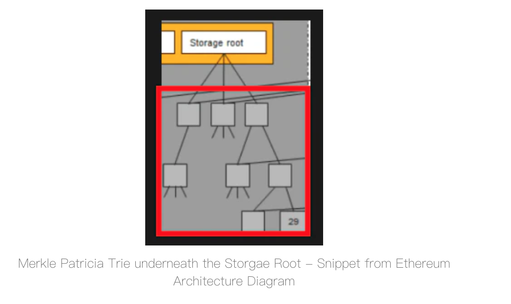  

像之前一样，'Storage Root'是默克尔根哈希，它会因为任一底层数据变化而变化。  
  
合约storage的任何变化都会影响到 "Storage Root"，进而影响到 "State Root"，进而影响到 "Block Header"。  
  
文章到这里，我们已经成功把你从一个以太坊区块深入到一个合约的存储空间。   
  
文章的下一部分是对Geth代码库的深入探讨。我们将简要地看一下合约存储是如何初始化的，以及当调用SSTORE & SLOAD操作码时会发生什么。  
  
这将帮助你从我们到目前为止所讨论的内容，回到你的 solidity 代码和底层存储操作码，建立起联系。  
  
*ummm，下面的内容涉及代码比较多，假定读者有基础的代码阅读理解能力*   

---

 
# StateDB -> stateObject -> StateAccount
为了开始之后的内容，我们需要一个全新的合约。一个全新的合约意为着一个全新的状态账户(StateAccount)。 
   
我们先介绍三个结构：
- StateAccount：状态账户是以太坊账户的”共识代表“（不知道咋翻译）
- stateObject：stateObject代表一个正在被修改的 "Ethereum账户"。
- StateDB：以太坊协议内的StateDB结构是用来存储Merkle trie内的任何东西。它是检索合约和以太坊账户的总查询接口。  

让我们看看这3个概念是如何相互关联的，以及它们与我们一直在讨论的内容有何关联。  

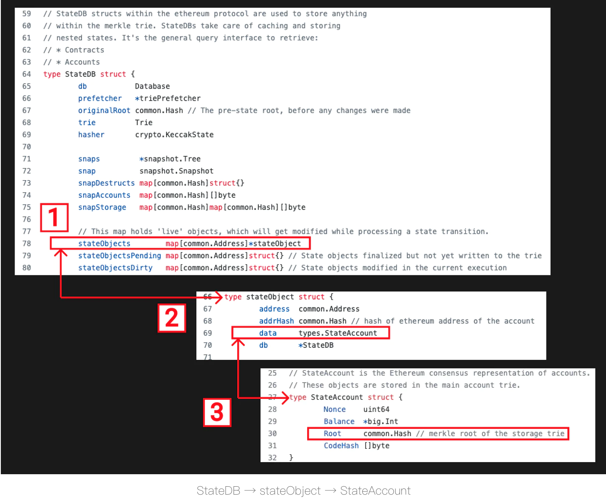  
1. StateDB结构，我们可以看到它有一个stateObjects字段，是地址到stateObjects的映射表（记得 "State Root"Merkle Patricia Trie是以太坊地址到以太坊账户的映射，stateObject是一个正在被修改的以太坊账户。）
2. stateObject结构，我们可以看到它有一个数据字段，属于StateAccount类型（记得在文章的前面，我们将Ethereum账户映射到Geth中的StateAccount）。
3. StateAccount结构，我们已经学习了这个结构，它代表一个以太坊账户，Root字段代表我们之前讨论的 "Storage Root"。
在这个阶段，一些拼图的碎片开始拼凑起来。现在我们有了背景，可以看到一个新的 "以太坊账户"（StateAccount）是如何初始化的。  

--- 
# 初始化一个新的以太坊账户
为了创建一个新的StateAccount，我们需要与[statedb.go](https://github.com/ethereum/go-ethereum/blob/d4d288e3f1cebb183fce9137829a76ddf7c6d12a/core/state/statedb.go)代码和StateDB结构交互。  
   
StateDB有一个createObject函数，可以创建一个新的stateObject，并将一个空的StateAccount传给它。这实际上是创建一个空的"以太坊账户"。  
  
下图详细说明了代码流程。 
  
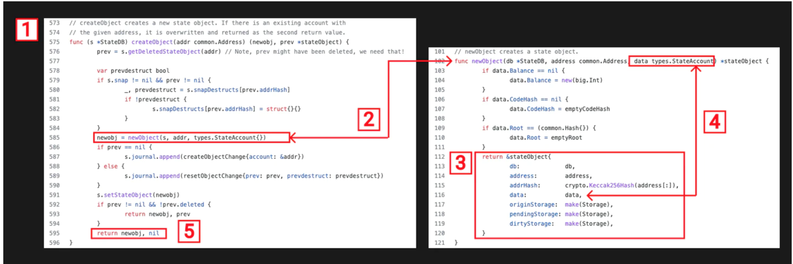  
1. StateDB有一个createObject函数，它接收一个Ethereum地址并返回一个stateObject（记住一个stateObject代表一个正在修改的Ethereum账户。）

2. createObject函数调用newObject函数，输入stateDB、地址和一个空的StateAccount（记住一个StateAccount=以太坊账户），返回一个stateObject。

3. 在newObject函数的返回语句中，我们可以看到有许多与stateObject相关的字段，地址、数据、dirtyStorage等。

4. stateObject的data字段映射到函数中的空StateAccount输入--注意在第103-111行StateAccount中的nil值被赋值。

5. 创建的stateObject包含初始化的StateAccount作为数据字段被返回。  

好了，我们有一个空的stateAccount，接下来我们要做什么？  
   
我们想存储一些数据，为此我们需要使用SSTORE操作码。  
# SSTORE
在我们深入了解Geth中的SSTORE实现之前，让我们快速回忆SSTORE的作用。   
   
它从堆栈中弹出两个值，首先是32字节的key，其次是32字节的value，并将该值存储在由key定义的指定存储槽中。
下面是SSTORE操作码的Geth代码流程，让我们看看它的作用。  

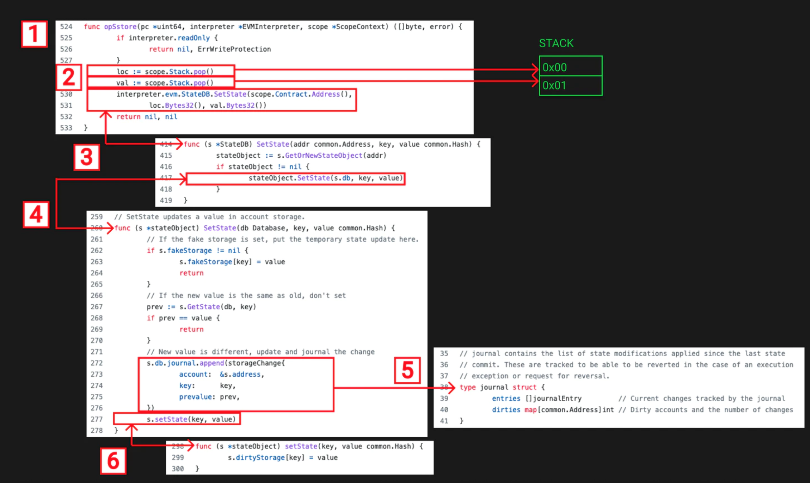   

1. 我们从定义了所有EVM操作码的instruments.go文件开始。在这个文件中，我们找到了 "opSstore "函数。

2. 传入该函数的范围变量包含合同上下文，如堆栈、内存等。我们从堆栈中弹出2个值，并标记为loc（位置的缩写）和val（值的缩写）。

3. 然后，从堆栈中弹出的2个值以及合约地址一起被用作StateDB对象的SetState函数的输入。SetState函数先用合约地址来检查该合约是否存在一个stateObject，如果不存在，它将创建一个。然后，它在该stateObject上调用SetState，传入StateDB db、相应的key和value值。

4. stateObject SetState函数对'fake storage'做了一些空值检查，然后检查value是否有变化，如果有变化，则通过journal结构记录变化。

5. 如果你看一下关于journal结构的代码注释，你会发现journal是用来跟踪状态修改的，以便在出现执行异常或请求撤销的情况下可以恢复这些修改。

6. 在journal结构被更新后，storageObject的setState函数被调用，入参为key和value。这将更新storageObjects的dirtyStorage。
好了，我们已经用key和value更新了stateObject的dirtyStorage。这实际上意味着什么，它与我们到目前为止所学的一切有什么关系?  

让我们从代码中的dirtyStorage定义继续学习。  
  
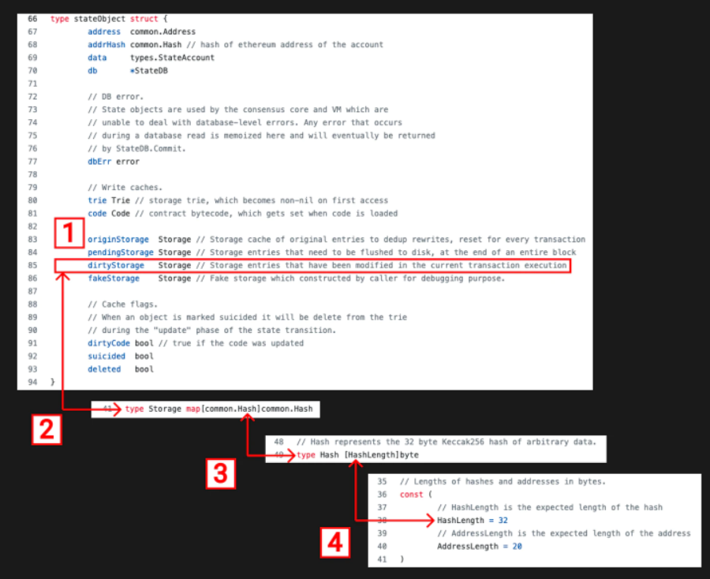  
1. dirtyStorage被定义在stateObject结构中，它属于Storage类型，被描述为 "在当前交易执行中被修改的存储条目"。  
2. 与dirtyStorage相对应的存储类型是common.Hash到common.Hash的简单映射。  
3. Hash类型只是一个长度为HashLength的数组。  
4. HashLength是一个常数，定义为32  
这对你来说应该很熟悉，一个32字节的key映射到一个32字节的value。这正是我们在EVM深度探讨的第三部分中从概念上看待合约storage存储空间的方式。   

你可能已经注意到stateObject中的pendingStorage和originStorage就在dirtyStorage字段的上方。它们都是相关的，在最终确定过程中，dirtyStorage被复制到pendingStorage，而pendingStorage在 trie被更新时又被复制到originStorage。    
   
在 trie 被更新后，StateAccount 的 "存储根 "也将在 StateDB 的 "提交 "中被更新。这将把新的状态写入底层的内存 trie 数据库中。    
    
现在到了拼图的最后一块，SLOAD。

# SLOAD
让我们再次快速回忆，SLOAD操作码做什么。  
  
它从堆栈中弹出1个值，32字节的key，它代表存储槽，并返回存储在那里的32字节的value。   
   
下面是SLOAD操作码的Geth代码流程，让我们看一下它的作用    
    
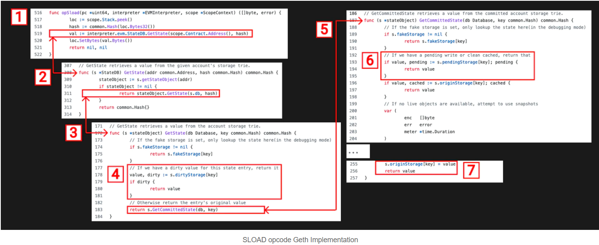  
1. 我们再次从 instructions.go 文件开始，在那里我们可以找到 "opSload "函数。我们使用peek从堆栈的顶部抓取SLOAD的位置（存储槽）。

2. 我们调用StateDB上的GetState函数，输入合约地址和slot位置。GetState函数返回与该合约地址相关的stateObject。如果返回的stateObject不是空值，则调用该stateObject上的GetState函数。

3. 在stateObject上的GetState函数对fakeStorage进行了检查，然后对dirtyStorage进行检查。
4. 如果dirtyStorage存在，返回dirtyStorage映射表中位置key相对应的值。(dirtyStorage代表了合约的最新状态，这就是为什么我们试图首先返回它)

5. 否则就调用GetCommitedState函数，尝试在storage trie中查找该值。同样需要先检查fakeStorage。

6. 如果pendingStorage存在，返回pendingStorage映射表中位置key相对应的值。

7. 如果上述方法都没有返回，就去找originStorage，从那里检索并返回值。
你会注意到，该函数试图先返回dirtyStorage，然后是pendingStorage，最后是originStorage。这是有道理的，在执行过程中，dirtyStorage是最新的存储映射，其次是pending，然后是originStorage。
   
一个交易可以多次操作一个存储槽，所以我们必须确保我们有最新的值。   
   
让我们想象一下，在同一交易中，在同一存储槽的SLOAD之前，发生了一个SSTORE。在这种情况下，dirtyStorage将在SSTORE中被更新，在SLOAD中被返回。   
    
到这里，你应该对SSTORE和SLOAD是如何在Geth客户端层面实现的有了了解。它们如何与状态和存储对象互动，以及更新存储槽与更广泛的以太坊 "世界状态 "的关系。   
    
这很紧张，但你做到了。我猜这篇文章给你留下了比你开始之前更多的问题，但这也是加密货币的乐趣之一。    

继续磨练吧，伙计。