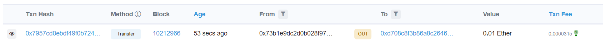
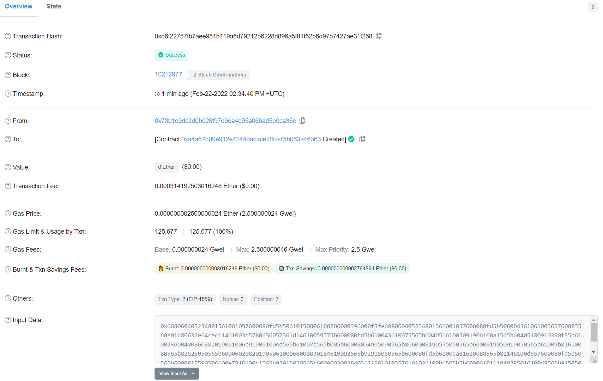
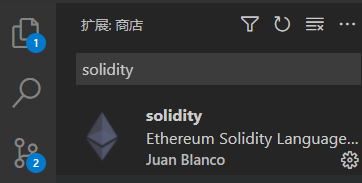
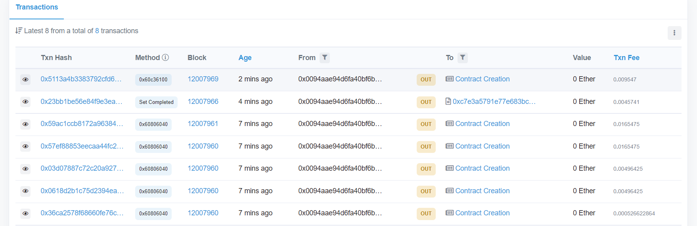
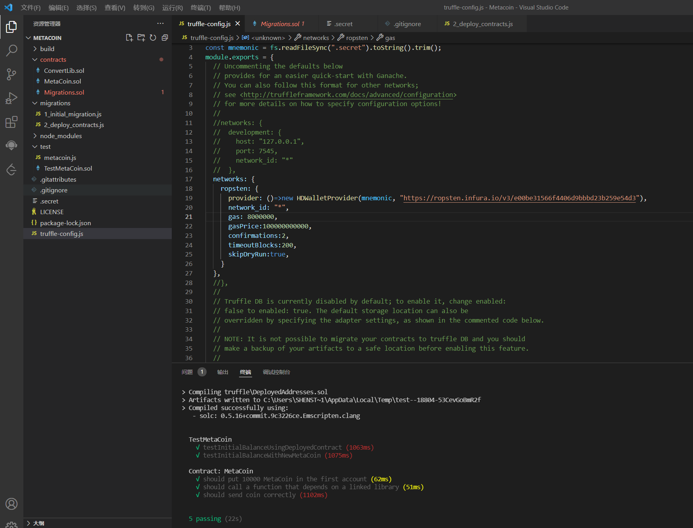

# 1. 安装Metamask，并创建好账号

# 2. [执行一次转账](https://rinkeby.etherscan.io/tx/0x7957cd0ebdf49f0b7246ab71031210cd83aa0940ec8baf4f34d02e0bbe0a3cc9)

# 3. [Creat contract on test-net](https://rinkeby.etherscan.io/tx/0xd6f22757fb7aee981b419a6d79212b6228d896a5f81f52b6d97b7427ae31f268)

# 4. solidity plugin on VScode

# 5. Creat contract on Ropsten by truffle

# 6. Try test.ts on Truffle

# 7. Creat contract Counter on Hardhat and write test.js

