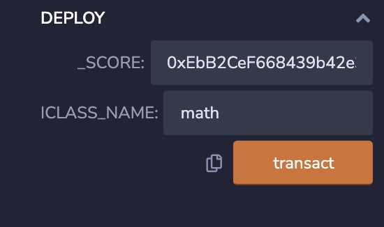

# 1.部署score合约
[https://rinkeby.etherscan.io/tx/0x9b1eda36f4e74db2634417f74f854eb5a86076bbc827b09bec7953cc907d3ec6](https://rinkeby.etherscan.io/tx/0x9b1eda36f4e74db2634417f74f854eb5a86076bbc827b09bec7953cc907d3ec6)
# 2.部署teacher合约
[https://rinkeby.etherscan.io/tx/0x4f00ee56143cda86f947efca1d324af4d9e21a549479da91949a689a6b82ccf6](https://rinkeby.etherscan.io/tx/0x4f00ee56143cda86f947efca1d324af4d9e21a549479da91949a689a6b82ccf6]
- constructor入参(注:老师分为不同学科，不同学科老师只能给本门课学生打分）

# 3.teacher给学生打分
