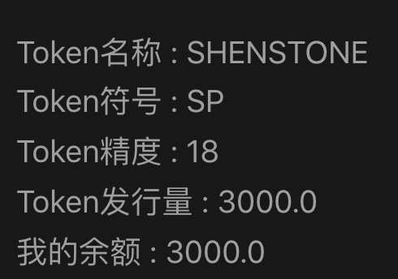
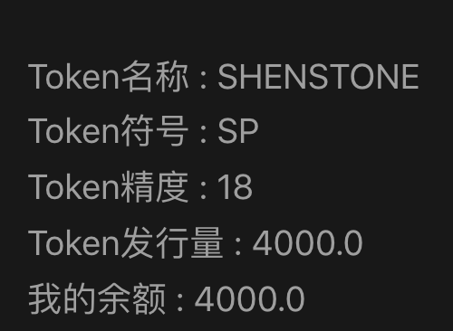
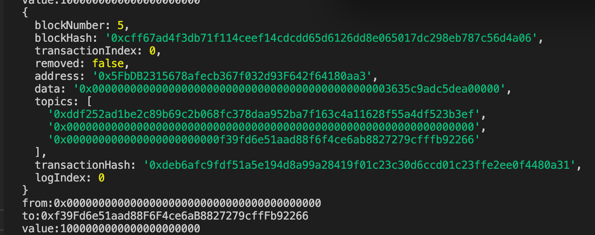
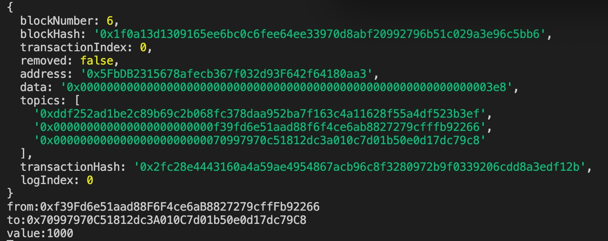
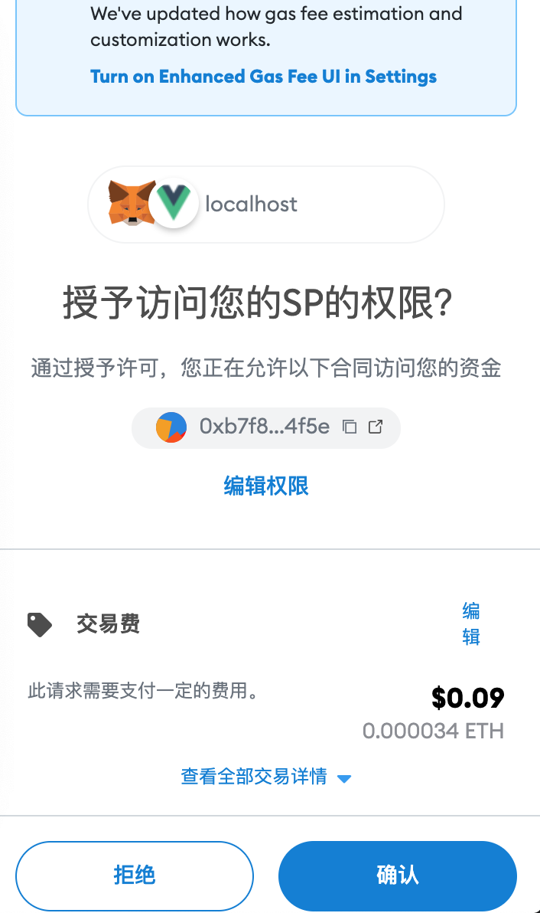
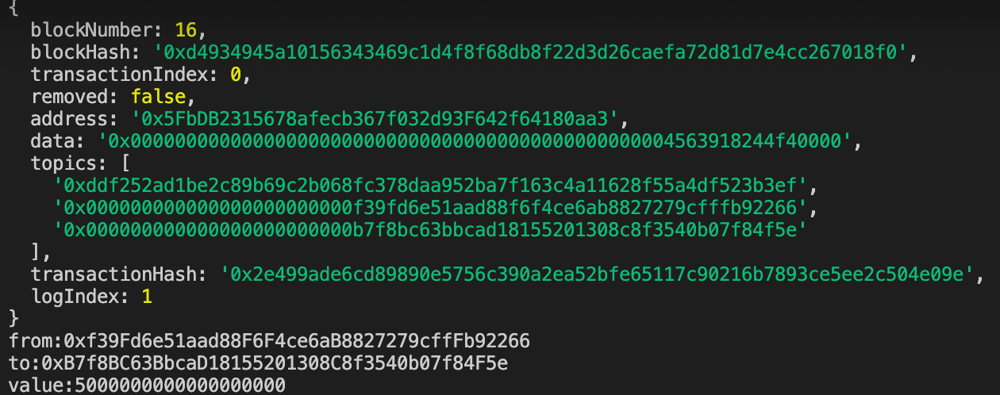
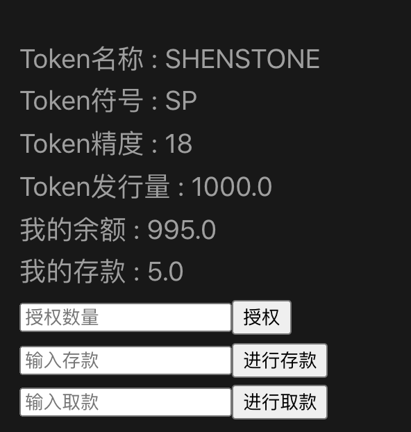
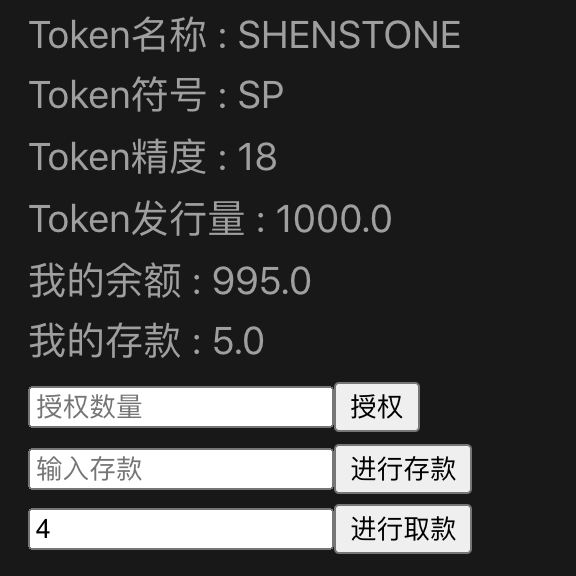
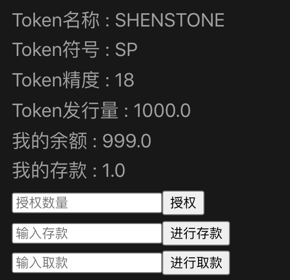
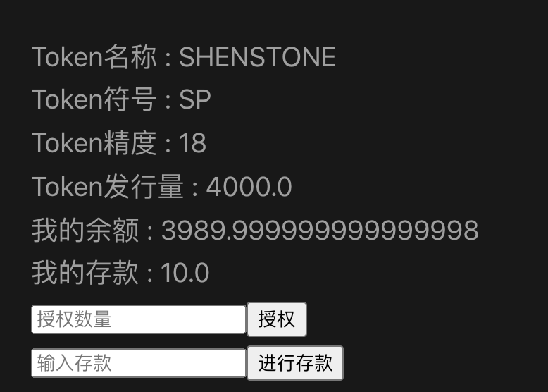

## 1. token可动态增发 
[contract_code](../project_code/contracts/shenstone.sol)  
调用mint函数，增发给owner  
---
调用前  

---
调用后  

---
交易event日志   

---
## 2. 通过ether.js转账  
[transfer_code](../project_code/scripts/transfer.js)  
转账event日志  

---
## 3. deposit 存款    
[contract_code](../project_code/contracts/vault.sol)  
approve记录  

---
deposit event日志  

---

## 4. withdraw 取款 
取款前，vault账户5sp  

---
取款中，取4个sp  

---
取款后，vault账户1sp  

---
## 5. 前端显示存款  
[front-end_code](../project_code/vue_project/components/erc20.vue)

