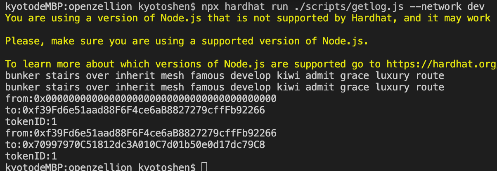

# 1. 发行一个721 token
[ERC721_contract_code](../project_code/contracts/myNft.sol)  
[deploy_code](../project_code/scripts/deploy_erc721.js)

# 2.使用ether.js解析 ERC721 转账事件
转账脚本执行转账  
[transfer_code](../project_code/scripts/transfer_erc721.js)  
解析区块1到区块10的所有转账  
[parse_code](../project_code/scripts/getlog.js)  
