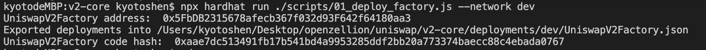
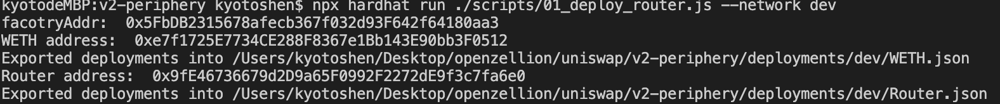
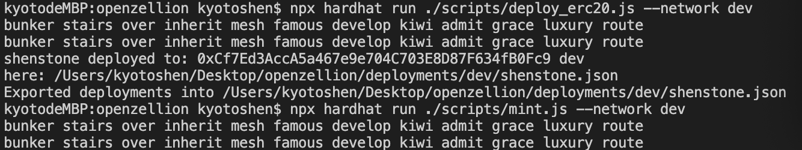
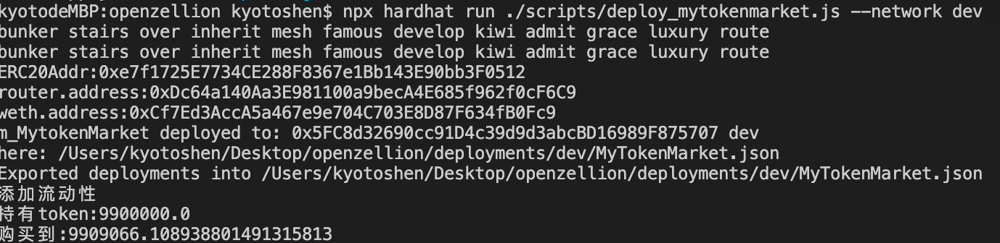
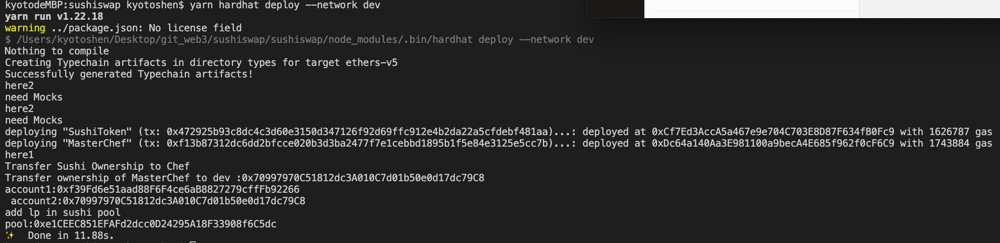

# w4-1
## 1 部署自己的 ERC20 合约 MyToken  
link here: [mytoken_code](./project/contract/shenstone.sol)  
## 2 编写合约 MyTokenMarket 实现： 
link here: [MyTokenMarket_Code](./project/contract/MyTokenMarket.sol)  


## 3 整体流程
### 3.1 部署uniswapFactory合约  
   
link here: [01_deploy_factory](./uniswap/v2-core/scripts/01_deploy_factory.js)    

### 3.2 部署weth合约以及uniswapRouter合约  
  
link here: [02_deploy_weth_router](./uniswap/v2-periphery/scripts/01_deploy_router.js)   
### 3.3 部署mytoken以及mint  
  

### 3.4 添加mytoken和eth的流动性，以及用eth购买token
    
link here: [部署合约脚本](./project/scripts/deploy_mytokenmarket.js)    


## W4_2作业
### 1 在上一次作业的基础上：
1.0 部署sushitoken，masterchef和add lptoken(mycoin,weth)  
  

1.1 完成代币兑换后，直接质押 MasterChef  

 个人看法。deposit的不是lptoken吗，代币兑换又没产生lptoken，所以我添加在addLiquitity函数里了。   
 ```
function AddLiquidity(
        uint amountMytokenDesired
    )  external  payable returns (uint amountA, uint amountETH, uint liquidity, address lptoken){
        //从用户账户中转出amountMytokenDesired数量的coin到本合约，并授权给UniswapV2Router
        IERC20(coin).safeTransferFrom(msg.sender, address(this), amountMytokenDesired);
        IERC20(coin).safeApprove(UniswapV2Router, amountMytokenDesired);

        //调用uniswapRouter添加[coin, weth]的流动性，最终添加了amountA数量的coin和amountETH数量的weth，获得liquidity数量的lpToken
        (amountA, amountETH, liquidity) = IUniswapV2Router01(UniswapV2Router).addLiquidityETH{value:msg.value}(coin, amountMytokenDesired,  0, 0, address(this), block.timestamp);
        //获取lptoken的地址，并存入本合约账户
        lptoken = IUniswapV2Factory(UniswapFactory).getPair(address(coin), address(WETH));
        deposit_vault[msg.sender][lptoken] = liquidity;

        //退还多余的eth和token
        if (msg.value > amountETH) {
            bool ret = transfer(payable(msg.sender), msg.value - amountETH);
            require(ret, "withdraw failed");
        }
        if (amountMytokenDesired > amountA){
            IERC20(coin).safeTransferFrom(address(this), msg.sender, amountMytokenDesired - amountA);
        }

        //deposit to sushi pool
        IERC20(lptoken).safeApprove(SushiChef, ~uint256(0));
        IMasterChef(SushiChef).deposit(0, liquidity);
    }
    //function explain: buy amount
    function BuymyTokenWithExactETH(
        uint amountOutMin
    )external payable  returns(uint[] memory amounts){
        address[] memory path = new address[](2);
        path[0] = WETH;
        path[1] = coin;
        amounts = IUniswapV2Router01(UniswapV2Router).swapExactETHForTokens{value: msg.value}(amountOutMin, path, msg.sender, block.timestamp);

    }

 ```
1.2 withdraw():从 MasterChef 提取 Token 方法
这里提取合约里该账户存的lp
```
function withdrawLiquidity(address _lptoken)external{
        uint256 amount = deposit_vault[msg.sender][_lptoken];
        require(amount > 0, "u don't have lptoken");
        IMasterChef(SushiChef).withdraw(0, amount);
        IERC20(_lptoken).safeTransferFrom(address(this), msg.sender, amount);
    }
```
[code_link](./project/contract/MyTokenMarket_sushi.sol)
[script_link](./project/scripts/deploy_mytokenSushiMarket.js)
