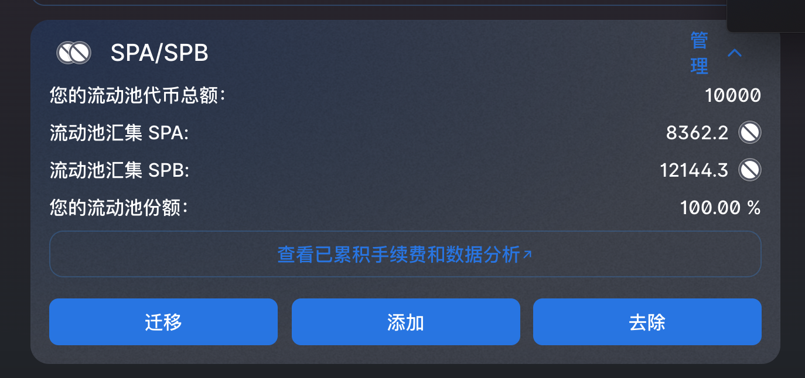
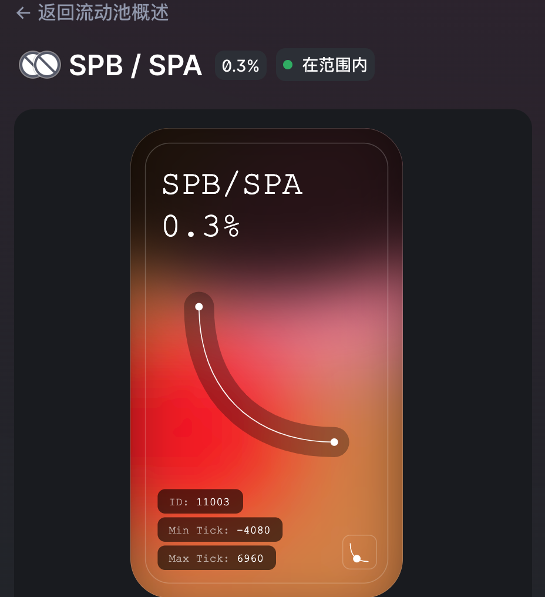
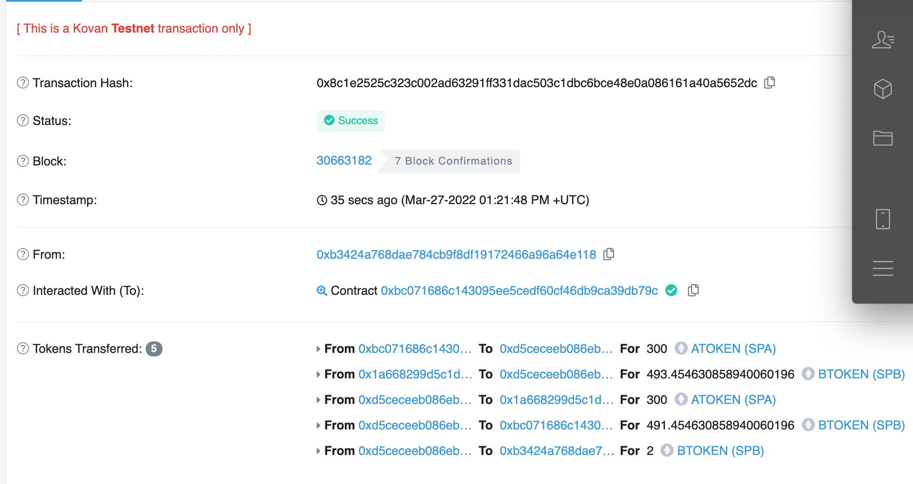

# W5_1作业
* 以太坊测试网上部署两个自己的ERC20合约MyToken，分别在Uniswap V2、V3(网页上)添加流动性  
[tokenA合约](./project/contracts/MytokenA.sol)  
[tokenB合约](./project/contracts/MytokenB.sol)  
---  
[uniswapV2流动性池子](https://app.uniswap.org/#/pool/v2?chain=kovan)  

---  
[uniswapV3流动性池子](https://app.uniswap.org/#/pool/11003?chain=kovan)  

* 作业：编写合约执行闪电贷（参考V2的ExampleFlashSwap）：
   * uniswapV2Call中，用收到的 TokenA 在 Uniswap V3 的 SwapRouter 兑换为 TokenB 还回到 uniswapV2 Pair 中。
[code_link](./project/contracts/flashSwap.sol)  
[部署合约脚本](./project/scripts/deploy_myFlashSwap.js)  
[执行闪电交换脚本](./project/scripts/run_flashswap.js)  
[交易详情链接](https://kovan.etherscan.io/tx/0x8c1e2525c323c002ad63291ff331dac503c1dbc6bce48e0a086161a40a5652dc)

   
# W5_2作业
* 在一笔交易中完成（模拟闪电贷交易）[project_code](./project/contracts/aave.sol)
   * 在 AAVE 中借款 token A
   * 使用 token A 在 Uniswap V2 中交易兑换 token B，然后在 Uniswap V3 token B 兑换为 token A
   * token A 还款给 AAVE

[合约代码](./project/contracts/aave.sol)