# Week 6-1
## 1. 设计了一个期权token[工厂合约](./project/contracts/UnioptV1Factory.sol)，可以根据行权日期以及价格调用createETHOptions创建一个期权token(ERC20)。同样可以设置手续费接收人，目前按0.3%的费率。:)  
link here: [工厂合约](./project/contracts/UnioptV1Factory.sol)  
link here: [部署合约脚本](./project/scripts/deploy_optFactory.js)  
link here: [期权token工厂合约创建TX](https://rinkeby.etherscan.io/address/0x00e7190414da922a01454c2ea78b7895dd6a4d8c)     
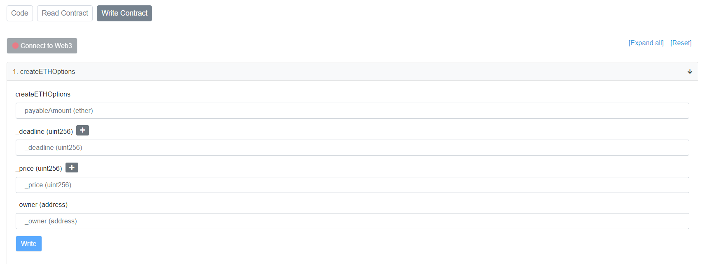  

## 2. 创建[期权Token],根据行权日期和价格来预测合约地址，并创建合约。  
link here: [期权token合约](./project/contracts/UniOptV1ERC20.sol)  
link here: [部署合约脚本,参数设置为行权日期1天后，ETH价格5200dai](./project/scripts/creat_opt.js)  
link here: [期权token工厂合约创建TX](https://rinkeby.etherscan.io/tx/0x2737c97915e4f97abf0bf7ebc7ee6df2f75ee1ed4cab6c5c0888f186dbb6c491) 
link here: [期权合约交互](https://rinkeby.etherscan.io/token/0x7e76917450576f5411acaead57ca7adfa1557d1a#readContract)  
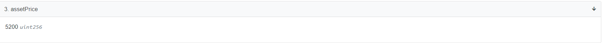  
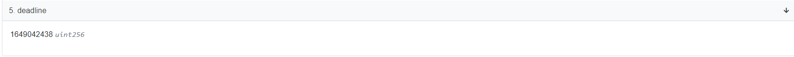  
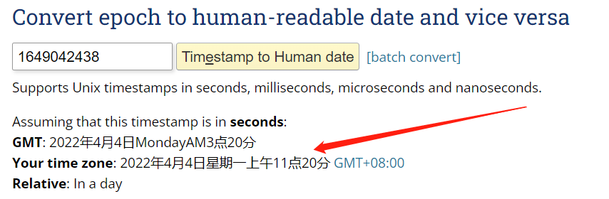  

## 3. 添加流动性  
link here: [添加流动池TX](https://rinkeby.etherscan.io/tx/0x04cf6a882988147ef9fe00bcc481c964fe0865081f01658b2b3ff8a20f98941f)
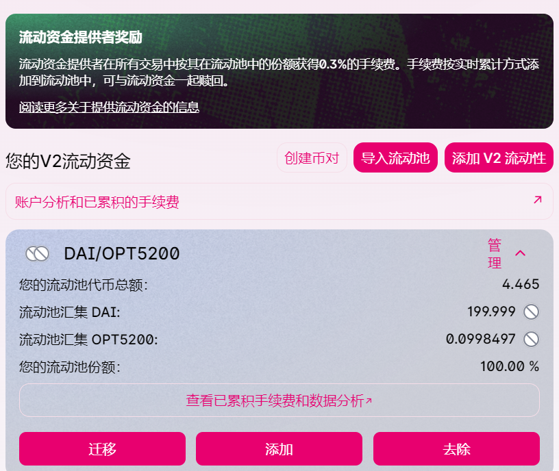  

## 4. 用户购买该行权token 
link here: [购买期权token](https://rinkeby.etherscan.io/tx/0x032018cb975fbdc16f6c87614a32a0c1a4147862f1c7636746f9643bc3a91454)  
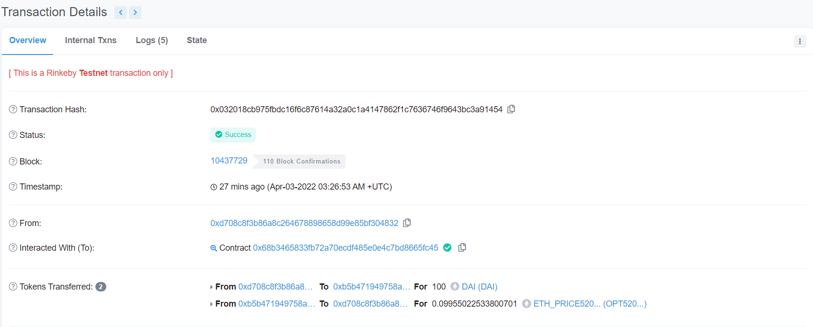  

## 5. 用户兑换资产  //toDo 4.4.2022

## 6. 项目方销毁过期token   //toDo 4.4.2022

---
# Week 6-2
## 1. 实现一个[治理合约Gov](./project/contracts/treasuryGov.sol)，构造函数里添加管理地址，以及需要几票通过提案  
link here: [治理合约Gov代码](./project/contracts/treasuryGov.sol)  
link here: [创建合约TX(已验证)](https://ropsten.etherscan.io/tx/0x23c24685b11648a371562e228fce8abd19b42e4636044033d567bdfd75208f3d)  
link here: [部署合约脚本](./project/scripts/621deploy_gov.js)  

## 2. 创建一个[Treasury合约](./project/contracts/treasury.sol)，并往里面存入ETH。  
link here: [Treasury合约](./project/contracts/treasury.sol)  
link here: [创建合约TX(已验证)](https://ropsten.etherscan.io/tx/0x3f9cc31afd6d55fba6e621ca6210e3f9397d25659f305ddeaeff612624c1edd7)  
link here: [部署合约脚本](./project/scripts/622deploy_treasure.js)  
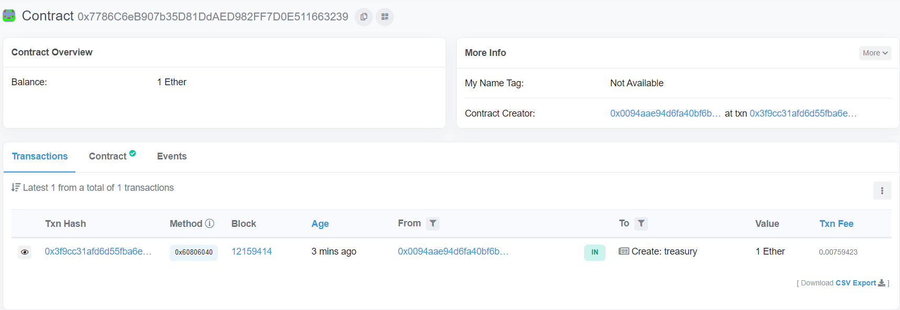  

## 3. 管理地址之一发起提案，提取Treasury中amount数量的eth到某一地址  
link here: [发起提案脚本](./project/scripts/623submitWithdraw.js)  
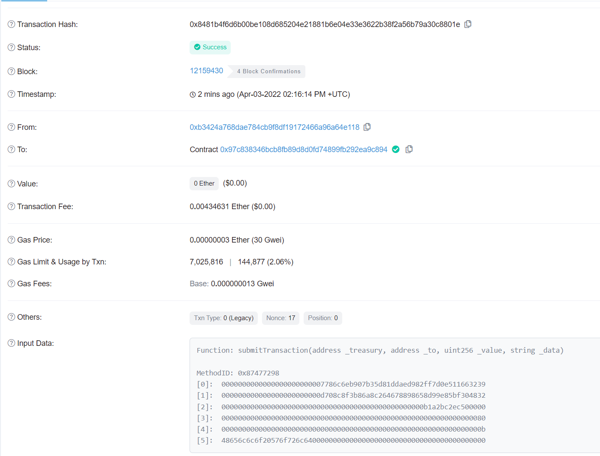  
  
    
    
发起提案后，查询治理合约Gov的transction数组  
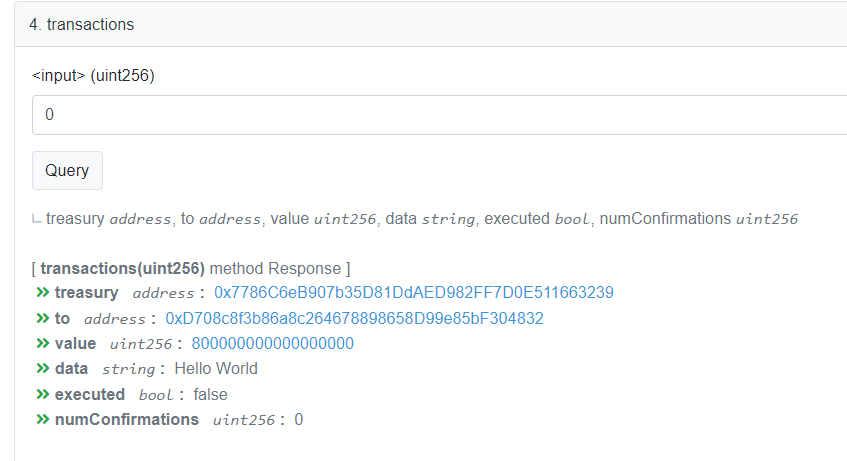  

## 4. 管理地址参与确认，并由某一管理地址执行该提款  
link here: [确认+提款脚本](./project/scripts/624withdraw.js)  
  
    

提款到指定地址成功  
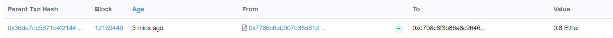  

可以看到此时，transctions数组中，标记为已执行  
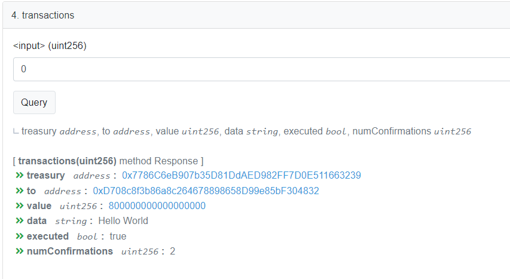

